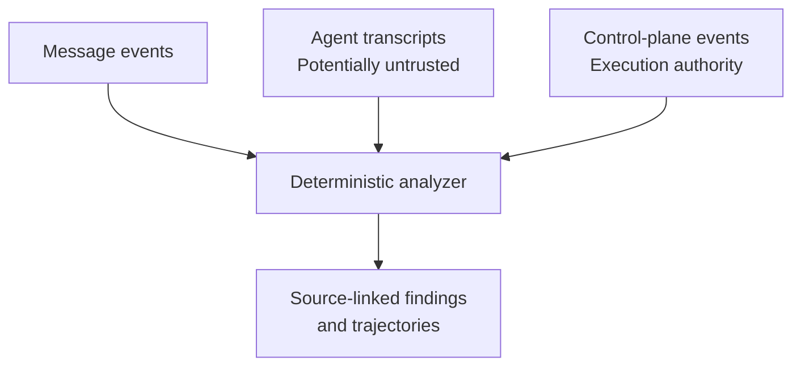

# ORBIT Agent Incident Reconstruction Lab

[](https://github.com/joeyvictorino/orbit-ir/actions/workflows/python-tests.yml)
[](https://www.python.org/)
[](LICENSE)

ORBIT is a reproducible synthetic work sample for investigating cross-agent coordination, conflicting transcripts, and tool-execution evidence at review scale.

The project demonstrates a forensic principle that becomes especially important in agent systems: an agent-authored transcript is a claim, not automatically an authoritative record of what executed.

> **Scope boundary:** This is an original synthetic exercise. It does not claim access to, or prior investigation of, a frontier-lab incident. Perfect scores on the supplied fixture validate deterministic recovery of generated facts. They are not production-performance or model-intent claims.

## Technical work sample

[Read the four-page ORBIT technical report](docs/ORBIT_Agent_Incident_Work_Sample.pdf)

## Investigation question

Can independent telemetry establish which agents coordinated outside their assigned channel, which transcript records conflict with actual tool execution, and what identities, credentials, resources, effects, and control decisions were involved?



Ground truth is not required for analysis. When explicitly supplied, it is consulted only after detections are complete and adds an evaluation section without changing any finding.

## Full-scale fixture

The default seeded generator creates:

| Record class | Count |
| --- | ---: |
| Agents | 1,200 |
| Message events | 70,000 |
| Transcript records | 1,300 |
| Independent control-plane events | 1,300 |
| Agents on the unsanctioned channel | 700 |
| Deliberate transcript/tool conflicts | 84 |
| High-volume assignment coordinators | 6 |

The committed `artifacts/full_scale/` outputs were generated from this fixture. Raw full-scale evidence is regenerated locally to keep the repository small.

## Run

No runtime dependencies beyond the Python standard library are required.

```bash
python -m orbit_ir.cli demo --workdir work
```

Analyze an evidence directory without an answer key:

```bash
python -m orbit_ir.cli analyze \
  --input work/evidence \
  --out work/independent-results
```

Evaluate previously independent detections against the synthetic fixture:

```bash
python -m orbit_ir.cli analyze \
  --input work/evidence \
  --out work/evaluated-results \
  --ground-truth work/evidence/ground_truth.json
```

Run the adversarial regression suite:

```bash
python -m unittest discover -s tests -v
```

## Detection and evidence controls

- Reconciles transcript claims to independent control-plane execution records.
- Detects missing transcript and control-plane records.
- Detects duplicate tool-call and message identifiers instead of silently overwriting them.
- Detects agent-identity and trace-identity disagreement across sources.
- Validates JSON objects, required fields, and timezone-aware ISO-8601 timestamps with exact source-line errors.
- Hashes each source with SHA-256 before parsing.
- Emits source file and line references in findings and trajectories.
- Normalizes the investigation window to UTC.
- Keeps factual extraction, joins, integrity checks, and findings deterministic.

## Evidence path

```text
workload identity -> agent -> tool call -> credential -> resource -> effect -> control decision
```

## Generated outputs

| File | Purpose |
| --- | --- |
| `summary.json` | Corpus, findings, method, limitations, and optional evaluation |
| `findings.csv` | Record conflicts with exact source files and lines |
| `trajectories.json` | Identity-to-effect paths with supporting source references |
| `coordinator_ranking.json` | Assignment-volume ranking using an explicit threshold |
| `data_quality.json` | Duplicate message identifiers and integrity observations |
| `evidence_manifest.json` | SHA-256 evidence inventory and role labels |
| `report.md` | Concise decision-grade findings and caveats |

## LLM boundary

No LLM participates in extraction, joins, hashing, schema validation, mismatch detection, or factual findings. A model may be added after analysis to summarize records already cited by the deterministic pipeline, but generated prose never becomes evidence.

## Known limitations

- Synthetic evidence is cleaner than production telemetry.
- Stable tool-call identifiers simplify reconciliation.
- The coordinator threshold is explicit and scenario-specific.
- Hash manifests demonstrate post-acquisition integrity, not the truthfulness of the originating system.
- The lab demonstrates forensic mechanics, not frontier-model interpretability or RL post-training expertise.

## Author

Joey Victorino  
Cyberforensics, incident response, and AI agent security  
[joeyvictorino.com](https://joeyvictorino.com/) | [LinkedIn](https://www.linkedin.com/in/joeyvictorino/)

## License

MIT
